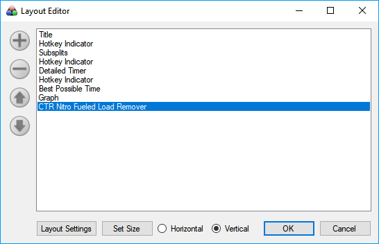
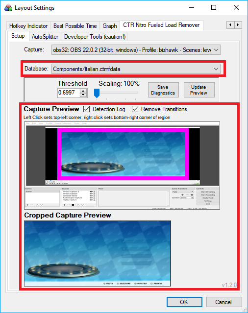
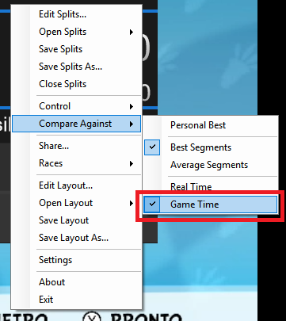

# How to set it up

Extract the .zip into your LiveSplit/Components folder, such that it contains all .crash4data files and LiveSplit.Crash4LoadRemover.dll.

Add this to LiveSplit by going into your Layout Editor -> Add -> Control -> Crash4LoadRemover.

You can then configure your capture settings (window/display) and capture region within the component settings in the Layout Settings.

If you set it up correctly, you can select the database file for your language in the "Database" drop down menu in the component settings.

Make sure that sure game footage is fully and accurately captured and that you don't distort/change the aspect ratio, color saturation, contrast or do any other aggressive filtering on the image footage, this will lead to detection issues.

Make sure that the "LOADING" text in the bottom right of each load screen is not covered in any way, otherwise you might encounter issues in load screen detection.

The "Threshold" in the settings is a value between 0 and 1 that can be fine-tuned if you have issues with detection.

If you don't detect load screens that you should detect (= timer runs during load screens) decrease the threshold. If you detect load screens that you shouldn't detect (= timer freezes during gameplay) increase the threshold.

The following screens show how it would be correctly set up:

# Common Issues / Guidelines when setting up

Here is a short list of things that you should do and common issues when setting this thing up:

- Make sure that the window/source you're capturing the game from is as large as possible. I know the whole "capturing from OBS" is not ideal, but please try to keep the game footage as large as possible for best results.

- Make sure that your game footage aspect ratio (that is the ratio between width and height of the game) is 16:9, which is the default/raw game footage. Do not squish/distort it in any way, for example in OBS, this WILL lead to worse detection performance!

- Choose the correct language database in the layout settings. 

- Make sure that the pink capture rectangle captures the game footage as close as possible. You can use the "Crop Rectangle" up/down UI elements to precisely position your crop rectangle. A better crop means better load remover performance.

- If you're capturing from a window, you must not minimize the window. Ideally, maximize it (for larger game footage size!) and just put your other stuff over it if you want to have it "hidden" from view. The only condition is that you must not minimize the window.

- You need to compare to "Game Time". This is easily set by right-clicking LiveSplit, selecting "Compare Against" and ticking "Game Time". Be careful that you don't have your Timer in your LiveSplit layout set to "Real Time", because this will override this setting.
- The default threshold of ~0.7 is already pretty low. If you followed all of the rules above (large capture region, aspect ratio, good crop), you should not need to lower the threshold. I don't have enough data to reliably predict when a threshold is too low, but consider a threshold lower than 0.5 to be problematic. This can potentially lead to loads being detected during normal gameplay, which will lead to headaches for leaderboard mods, as this would be an unfair advantage if undetected.
  If you find you require a threshold that is lower than this, please send me a link to a VOD/YouTube vid plus a screenshot of your Load Remover layout settings so that I can investigate and potentially improve the load remover databases for everyone. 

- The load remover is still very much in its early phase, and I need feedback and problematic game footage to improve the databases. I'm not sure how reliably it currently works overall. I seem to encounter no issues on most game footage, even when it's pretty small.

- About the "Scaling" setting: You should only need to change this if you have the Display Scaling set in Windows. (Display Settings -> "Change Size of text, apps and other items"). Otherwise you can leave this at 100%.

- This might not work for windows with DirectX/OpenGL surfaces, nothing I can do about that. (Use Display capture for those cases, sorry, although even that might not work in some cases). In those cases, you will probably get a black image in the capture preview in the component settings.

# LiveSplit.Crash4LoadRemover
LiveSplit component to automatically detect and remove loads from "Crash Bandicoot 4: It's About Time".

This is adapted from my Crash NST and Crash Team Racing: Nitro Fueled vision-based load removers: 

https://github.com/thomasneff/LiveSplit.CrashNSTLoadRemoval 

https://github.com/thomasneff/LiveSplit.CTRNitroFueledLoadRemover

and from https://github.com/Maschell/LiveSplit.PokemonRedBlue for the base component code.
